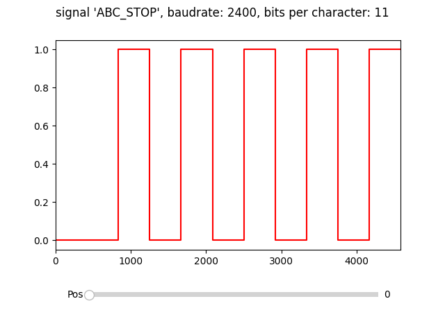

# README

The Python script `convert.py` can be used to convert infrared serial interface commands (in hexadecimal representation) into a Flipper Zero<sup>[1]</sup> compatible infrared<sup>[2]</sup> `.ir` file.

Use case: It can be used to convert LEGO MINDSTORMS RCX<sup>[3]</sup> (the "yellow programmable brick") infrared commands<sup>[4]</sup> (see `LEGO_RCX.json` input file).

The script supports sending multiple multibyte messages at once and adds wait times for message replies by default.

## References

[1] [Flipper Zero — Portable Multi-tool Device for Geeks](https://flipperzero.one/)

[2] [Flipper Zero Blog — Taking over TVs with Flipper Zero Infrared Port](https://blog.flipperzero.one/infrared/)

[3] *Disclaimer: LEGO and MINDSTORMS are trademarks and copyrights of the LEGO Group of companies which does not sponsor, authorize or endorse this site.*

[4] [RCX 2.0 Firmware Command Overview / LASM bytecode specification](https://www.inf.ed.ac.uk/teaching/courses/sdp/lego/LASM_Bytecodes.pdf)

## Dependencies

A Python 3 environment is required.

The script only imports `sys` and `json` and therefore shouldn't require any additional packages.


## Converter usage

Run converter and print output on stdout:

```
$ python convert.py LEGO_RCX.json
```

Run converter and pipe output to IR output file:

```
$ python convert.py LEGO_RCX.json > LEGO_RCX.ir
```

Run converter and pipe output to both an IR output file and stdout:

```
$ python convert.py LEGO_RCX.json | tee LEGO_RCX.ir
```

For the format of the `.json` file, inspect `LEGO_RCX.json` example.


## Plot usage

The IR signal plot script additionally requires the Python module `matplotlib`.

```
Usage: python3 plot_signal.py <IR_file_name> <IR_signal_name>
```

Example:

```
python plot_signal.py LEGO_RCX.ir ABC_STOP
Trying to open file 'LEGO_RCX.ir' and then to plot signal 'ABC_STOP'
Found signal:
  Raw signal name: ABC_STOP
  Raw signal data: 833 417 417 417 417 ...
```


